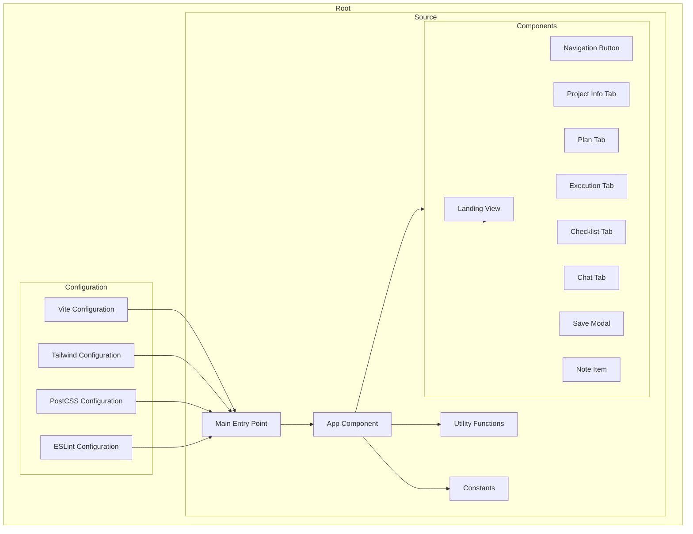

    

    <b>Automatic Architecture Diagrams from Code</b> 
    <a href="https://github.com/JashanMaan28/swark-continued">GitHub (Fork)</a> • <a href="https://github.com/swark-io/swark">Original Project</a>

## Usage Instructions

1. **Render the Diagram**: Use the links below to open it in Mermaid Live Editor, or install the [Mermaid Support](https://marketplace.visualstudio.com/items?itemName=bierner.markdown-mermaid) extension.
2. **Recommended Model**: If available for you, use `gemini` [language model](vscode://settings/swark-continued.languageModel). It can process more files and generates better diagrams.
3. **Iterate for Best Results**: Language models are non-deterministic. Generate the diagram multiple times and choose the best result.

## Generated Content
**Model**: GPT-4o - [Change Model](vscode://settings/swark-continued.languageModel)  
**Mermaid Live Editor**: [View](https://mermaid.live/view#pako:eNp9lMFu4yAQhl8FcW5fIIeVtmlWqtRWUZ32gqtogonDrg2WGdKNqr77jnG8MQ4uB2dm_m8Akx9_cmkLxRc8N2ULzYFt7nPDaDi_6wsv1mJfispLa_a69C2gtuaid-OoUW1l0MUbxTH7HsMIuvrQphgaNuf826bGOpTODT1rSpdZ9m2LcpU2OHSsskfKZhuUKXKTeOnM-laqeOIatBFP9GArg-2JrS3NPFnco66ceKWnxhP75Y3sFnQTCppG_Gwa2lXdWKOuZqG9OwSDTiyHaEKM_p3zFC4GulGBKbQpxWP_y960-ni_xgwctzuPaI14hqMuwxmxu1BJ4E1rfyuJW232Vqz7hD1QwjawS_G0jS3CTqwpmGHUXyV9t2wAV0M2Q8uDkn8q7TDQyyGbpWEAYY5xcFTb2hZQiYxC9tSFqaOyZHgyei2eKWIPFE3d1xnqKhnZbHRn2O3tj-CqXplckIka34SJGHl-pPVqF4ci-a6vUBAKwa5x6b_34vLYZ71yqQTgbLakdnFYUh47Kg2cLZQUI-8kicgvMwTMixdzpF9u8ERu-A2vVUvHXdB39jPneFC1yvmC5bxQe_AV5vyLIN8UgOpeA93hmi-w9eqGg0ebnYwc8tb68sAXe6ic-voH9GDLsw) | [Edit](https://mermaid.live/edit#pako:eNp9lMFu4yAQhl8FcW5fIIeVtmlWqtRWUZ32gqtogonDrg2WGdKNqr77jnG8MQ4uB2dm_m8Akx9_cmkLxRc8N2ULzYFt7nPDaDi_6wsv1mJfispLa_a69C2gtuaid-OoUW1l0MUbxTH7HsMIuvrQphgaNuf826bGOpTODT1rSpdZ9m2LcpU2OHSsskfKZhuUKXKTeOnM-laqeOIatBFP9GArg-2JrS3NPFnco66ceKWnxhP75Y3sFnQTCppG_Gwa2lXdWKOuZqG9OwSDTiyHaEKM_p3zFC4GulGBKbQpxWP_y960-ni_xgwctzuPaI14hqMuwxmxu1BJ4E1rfyuJW232Vqz7hD1QwjawS_G0jS3CTqwpmGHUXyV9t2wAV0M2Q8uDkn8q7TDQyyGbpWEAYY5xcFTb2hZQiYxC9tSFqaOyZHgyei2eKWIPFE3d1xnqKhnZbHRn2O3tj-CqXplckIka34SJGHl-pPVqF4ci-a6vUBAKwa5x6b_34vLYZ71yqQTgbLakdnFYUh47Kg2cLZQUI-8kicgvMwTMixdzpF9u8ERu-A2vVUvHXdB39jPneFC1yvmC5bxQe_AV5vyLIN8UgOpeA93hmi-w9eqGg0ebnYwc8tb68sAXe6ic-voH9GDLsw)

