    

    <b>Automatic Architecture Diagrams from Code</b> 
    <a href="https://github.com/JashanMaan28/swark-continued">GitHub (Fork)</a> • <a href="https://github.com/swark-io/swark">Original Project</a>

## Usage Instructions

1. **Render the Diagram**: Use the links below to open it in Mermaid Live Editor, or install the [Mermaid Support](https://marketplace.visualstudio.com/items?itemName=bierner.markdown-mermaid) extension.
2. **Recommended Model**: If available for you, use `gemini` [language model](vscode://settings/swark-continued.languageModel). It can process more files and generates better diagrams.
3. **Iterate for Best Results**: Language models are non-deterministic. Generate the diagram multiple times and choose the best result.

## Generated Content
**Model**: Gemini 3 Pro (Preview) - [Change Model](vscode://settings/swark-continued.languageModel)  
**Mermaid Live Editor**: [View](https://mermaid.live/view#pako:eNqNVttu2zAM_RXCwLYWSJv3oCuwJS2WIduKue0e7CJQbSXRJkuGJKcNhv37KMl2HF_S-MUUxcshRVL6GyQypcEkiMWKy5dkQ5SB-1ksAD9dPK8VyTcw5YwKs_ys5IumCqI48Bw4q1g3YsuUFBkyz-Pgyevbb0_dCKN2UUaYuPytX5_g4uIaPuX5VAqDPKr6dPYIpKLLhVyzxHnHldXlLCGGSQFu58Cv_ZrWI1xYv3D1rMbXEBpiKHwjgqwR_Xv4KQtDVUv_cFVjmRFDll-ISDkTawvHMkpbNgEdHPZzDkt_kVtM4E7J3zQxI3hk9GUE9-RZ92jeMk6dN1S0NIQ7bWgGJU9XEZEtHS8kSeFSFzlVW6YZBnaZ6G3LKBXpsTibWXOH1IT-hmgD617S-es5U2uXJcufVMtCJVTbVHoe1LxOLtGfNkQYHSUVhcda5uCeZjlHsHoEM7oiBTdITTc0-cOZNu3khmbHqY7uCeMvTKQwhmkYPr2N-8EwzgzzgP1iBwuyw5jbaL9Qjkeho43_I9KWwC-p0pvXXCoTzWTyCp7uVOI0fLwjChstQgo8ebRYS8fuUPY-hmVqByeEP1-6YG30d4pqrPiyCXtTsMBywD6xJR41aDcDDiW_k-1UZnmE_8-FMWhxjBhJ2gnVlvo3mRL-MI9qusfgQP_eUmIKHCeoVnB_ireFSGwMhEPFPbPteN7by3Oxkrgblf1bLnsA2O-OE-GE_X9Aqsup4d680qSw4ErAFm_Ns6OLbjGfvUDd2EVR679WGQbhDkEa6k8BiTnOmSOypWlXQJVeV7IzbvrjnW6IsTjL_4Dbupm96H7RI3_guFXN795h3rirW71hud7vtGYaiom06pJG_Z6mUJb0acKtujxNqdELfRdoW_VB07Lhq-nZp4XZKcFoKLS95eqZN2x6ntkRo-0ogS0jQ2NlXzT9Gl1cDQ0HP8zcI6Wa9bBSMhvSbZZIbcCW9XG1g1T42dnYLVvZ2vN7g2O2Af0NybLsT5I8DOmIeKPoG-MErxccdEv_jNB-nHhe-bQ4vHUXMiHcXux-MzqLgysGCSdaf_ywIrAiFyvc_XB9NWbXXhqa7xR_NZ81XiVfwx_f3W37iPP1_KmDtfGKgCvXd4cQYhGMgowqfEum-HT9Gwdmgy-vOJhAHKT-4o-DfyhU5CmWyIwRjD0LJkYVdBSQwshwJ5JqrWSx3gSTFeGa_vsPWBtL7Q) | [Edit](https://mermaid.live/edit#pako:eNqNVttu2zAM_RXCwLYWSJv3oCuwJS2WIduKue0e7CJQbSXRJkuGJKcNhv37KMl2HF_S-MUUxcshRVL6GyQypcEkiMWKy5dkQ5SB-1ksAD9dPK8VyTcw5YwKs_ys5IumCqI48Bw4q1g3YsuUFBkyz-Pgyevbb0_dCKN2UUaYuPytX5_g4uIaPuX5VAqDPKr6dPYIpKLLhVyzxHnHldXlLCGGSQFu58Cv_ZrWI1xYv3D1rMbXEBpiKHwjgqwR_Xv4KQtDVUv_cFVjmRFDll-ISDkTawvHMkpbNgEdHPZzDkt_kVtM4E7J3zQxI3hk9GUE9-RZ92jeMk6dN1S0NIQ7bWgGJU9XEZEtHS8kSeFSFzlVW6YZBnaZ6G3LKBXpsTibWXOH1IT-hmgD617S-es5U2uXJcufVMtCJVTbVHoe1LxOLtGfNkQYHSUVhcda5uCeZjlHsHoEM7oiBTdITTc0-cOZNu3khmbHqY7uCeMvTKQwhmkYPr2N-8EwzgzzgP1iBwuyw5jbaL9Qjkeho43_I9KWwC-p0pvXXCoTzWTyCp7uVOI0fLwjChstQgo8ebRYS8fuUPY-hmVqByeEP1-6YG30d4pqrPiyCXtTsMBywD6xJR41aDcDDiW_k-1UZnmE_8-FMWhxjBhJ2gnVlvo3mRL-MI9qusfgQP_eUmIKHCeoVnB_ireFSGwMhEPFPbPteN7by3Oxkrgblf1bLnsA2O-OE-GE_X9Aqsup4d680qSw4ErAFm_Ns6OLbjGfvUDd2EVR679WGQbhDkEa6k8BiTnOmSOypWlXQJVeV7IzbvrjnW6IsTjL_4Dbupm96H7RI3_guFXN795h3rirW71hud7vtGYaiom06pJG_Z6mUJb0acKtujxNqdELfRdoW_VB07Lhq-nZp4XZKcFoKLS95eqZN2x6ntkRo-0ogS0jQ2NlXzT9Gl1cDQ0HP8zcI6Wa9bBSMhvSbZZIbcCW9XG1g1T42dnYLVvZ2vN7g2O2Af0NybLsT5I8DOmIeKPoG-MErxccdEv_jNB-nHhe-bQ4vHUXMiHcXux-MzqLgysGCSdaf_ywIrAiFyvc_XB9NWbXXhqa7xR_NZ81XiVfwx_f3W37iPP1_KmDtfGKgCvXd4cQYhGMgowqfEum-HT9Gwdmgy-vOJhAHKT-4o-DfyhU5CmWyIwRjD0LJkYVdBSQwshwJ5JqrWSx3gSTFeGa_vsPWBtL7Q)

```mermaid
flowchart TD
    subgraph Client_Browser ["Client (Browser Environment)"]
        
        Entry[main.jsx] --> AppContainer
        
        subgraph Core_Logic ["Core Application Logic"]
            AppContainer[App.jsx <br/> State Manager & Router]
            
            subgraph Data_Handling ["Data Management"]
                StateManager[State: Project, View, Tabs]
                FileHandler[File System Handlers <br/> Save/Load .supervisi & .csv]
            end
            
            AppContainer --> StateManager
            AppContainer --> FileHandler
        end

        subgraph Static_Resources ["Static Resources"]
            Constants[constants.js <br/> Templates, Defaults, Checklists]
            Styles[Tailwind / CSS]
        end

        subgraph Utilities ["Utility Layer"]
            Helpers[helpers.js]
            WordExport[Docx Exporter]
            CSVParser[CSV Parser]
            
            Helpers --> WordExport
            Helpers --> CSVParser
        end

        subgraph UI_Layer ["Presentation Layer"]
            LandingView[LandingView.jsx]
            NavComp[NavButton / Header]
            SaveModalUI[SaveModal.jsx]
            
            subgraph Feature_Modules ["Functional Modules (Tabs)"]
                InfoTab[ProjectInfoTab.jsx]
                PlanTab[PlanTab.jsx]
                
                subgraph Execution_Module ["Execution & Review"]
                    ExecTab[ExecutionTab.jsx]
                    NoteComp[NoteItem.jsx]
                    ExecTab --> NoteComp
                end
                
                ChatTab[ChatTab.jsx]
                ChecklistTab[ChecklistTab.jsx]
            end
        end

        %% Relationships
        AppContainer -- Renders --> LandingView
        AppContainer -- Renders --> NavComp
        AppContainer -- Renders --> Feature_Modules
        AppContainer -- Renders --> SaveModalUI
        
        AppContainer -- Uses --> Constants
        
        %% Features using Utilities
        AppContainer -- Imports CSV via --> CSVParser
        ExecTab -- Imports CSV via --> Constants
        ExecTab -- Uses Smart Templates from --> Constants
        ChecklistTab -- Uses Items from --> Constants
        
        %% Exports
        PlanTab -- Export --> WordExport
        ExecTab -- Export --> WordExport
        ChatTab -- Export --> WordExport
        ChecklistTab -- Export --> WordExport
    end

    subgraph External_Systems ["External Systems"]
        LocalFileSystem[("<i class='fa fa-file'></i> Local File System <br/> (.supervisi JSON / CSV)")]
    end

    FileHandler <--> LocalFileSystem
```

